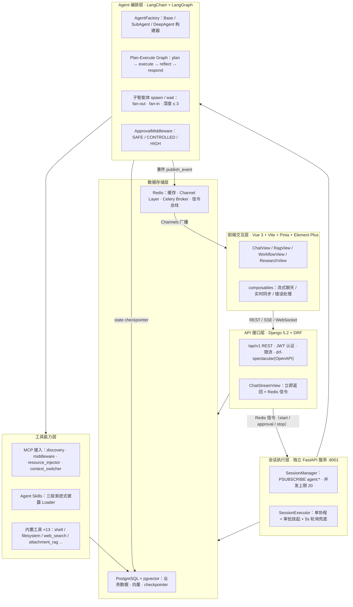

# LangChain 多智能体应用平台

> 基于 Django 5.2 + LangGraph + MCP + Agent Skills 的多智能体应用平台。后端 **15 个 Django 应用**，覆盖智能体对话、深度研究、知识库 RAG、工作流学习四类场景，支持 6 类模型服务接入与 Human-in-the-loop 工具调用审批。


---

## 目录

- [核心亮点](#核心亮点)
- [系统架构](#系统架构)
- [一次请求的完整链路](#一次请求的完整链路)
- [关键设计决策](#关键设计决策)
- [功能模块](#功能模块)
- [RAG 检索质量评测](#rag-检索质量评测)
- [技术栈](#技术栈)
- [快速开始](#快速开始)
- [目录结构](#目录结构)
- [已知限制与 Roadmap](#已知限制与-roadmap)
- [免责声明](#免责声明)

---

## 核心亮点

- **LangGraph 多 Agent 编排**：Plan-Execute 图（`plan → execute → reflect → 条件路由 → respond`）+ 子智能体 `spawn`/`wait` 的 fan-out / fan-in，父图 `interrupt` 挂起、子任务全部终态后 `resume` 唤醒，嵌套深度上限 3 层。
- **MCP 协议接入**：实现工具**动态发现与注册、调用拦截与结果格式统一、资源注入、上下文切换**，并适配 LangGraph，使 MCP 工具与内置工具在同一 `ToolNode` 内无缝混用。
- **Agent Skills 规范实现**：`SkillLoader` 按「元数据常驻 → 命中加载 `SKILL.md` → 执行期按需加载 `references/` `scripts/`」实现**三级渐进式披露**，解决工具文档膨胀上下文的问题。
- **RAG 全链路**：8 类文档解析 → 自适应分块 → pgvector 向量存储 → 多路召回 RRF 融合 + 交叉编码器重排序 → NLI 事实一致性校验 → 来源引用回传。
- **Human-in-the-loop 审批**：工具调用按 SAFE / CONTROLLED / HIGH 三级管控，高危操作强制人工确认，含 5 分钟超时兜底、批量恢复与熔断保护。
- **执行与 HTTP 连接解耦**：长任务由独立 FastAPI 会话执行服务承载，Django 仅负责鉴权、持久化与 Redis 信令分发，进程重启后可恢复未完成会话。

---

## 系统架构



---

## 一次请求的完整链路

1. **前端** 发起 `POST /api/v1/chat/.../stream/`，携带 JWT。
2. **Django** 完成鉴权、限流、会话与消息落库后，**立即返回 `{"status": "started"}`**（不再占用 HTTP 连接等待模型输出），同时通过 `signal_bus.publish_signal` 向 Redis 通道 `agent:start:{thread_id}` 发布信令。
3. **FastAPI 会话执行服务**通过 `PSUBSCRIBE agent:*` 收到信令，`SessionManager` 分配会话槽，`SessionExecutor` 在单协程内驱动 LangGraph。
4. **Agent 编排层**按图流转：`plan` 生成计划 → `execute` 调用工具 → `reflect` 反思并可修订计划 → 条件路由至 `respond`。若命中高危工具，`ApprovalMiddleware` 触发 `interrupt` 挂起，落库生成审批单。
5. **工具能力层**执行 MCP 工具 / Agent Skills / 内置工具，读写 PostgreSQL + pgvector。
6. **状态持久化**：每步经 checkpointer 落库（postgres / sqlite / memory 三后端可选），支持断点恢复。
7. **事件回推**：执行器复用 Django 的 `realtime_sync.publish_event` 向 Redis 广播，Channels 网关转发至 WebSocket 分组 `user_{id}` / `session_{id}`，前端实时渲染。
8. **一致性保障**：DB 是唯一真相源，Redis 信令仅做即时唤醒；信令丢失时执行器以 5s 间隔轮询 DB 兜底，保证最终一致。

---

## 关键设计决策

> 以下每条均为开发过程中真实遇到并解决的问题，记录「为什么这么选」。

### 1. 长任务为什么拆到独立 FastAPI 服务？

深度研究任务单次可达数分钟，若在 Django 同步 worker 内执行会占满进程、拖垮整个 Web 端。拆分的三个理由：

- 长任务与 HTTP 连接解耦，前端不再挂起等待；
- `psycopg` 异步驱动要求 `SelectorEventLoop`，Windows 默认 `ProactorEventLoop` 不兼容，需要独立进程控制事件循环；
- 独立进程可单独限流（`max_concurrency=20`）与重启，不影响 Web 端可用性。

代价是引入分布式一致性复杂度 → 用「**DB 唯一真相源 + Redis 信令即时唤醒 + 执行器轮询兜底**」的三层策略收敛。

### 2. Windows 上 psycopg 异步驱动与 ProactorEventLoop 不兼容

显式设置 `WindowsSelectorEventLoopPolicy`，并注意 **uvicorn 0.36+ 必须传 `loop="none"`** 才会遵循该 policy（默认 `loop="auto"` 会强制使用 `ProactorEventLoop`）。

> 因此本项目**不要**用 `python -m uvicorn` 启动执行服务，必须使用 `python run_fastapi.py`。

### 3. 异步 checkpointer 必须按 `loop_id` 隔离实例

`AsyncPostgresSaver` 内部持有 `asyncio.Lock`，而 Lock 在**创建时**就绑定了当时的事件循环。若在主 loop 创建、在子线程的新 loop 复用，会直接抛 `bound to a different event loop`。

方案：`checkpointer_factory` 按 `loop_id` 缓存独立实例；并对主 loop 上的 PG 连接池做常驻注册，避免单个会话结束就关闭其他挂起会话所依赖的连接。

### 4. WebSocket 历史回放导致前端「慢半拍」

现象：刷新页面后消息总是慢一步出现。定位为**单帧数据超过 Channels 上限**——历史 500 条事件一次性 `send_json` 达 3.86MB，超出 1MB 限制。

方案：改为**分块回放**（单块 ≤ 768KB 且 ≤ 50 个事件），并对长连接设置 `CONN_MAX_AGE=10s` + 每 15s 执行 `close_old_connections()`，避免 N 个常驻 WS 连接耗尽数据库连接池。

### 5. 批量 interrupt 解决 LangGraph Send API 限制

LangGraph 的 Send API **只会捕获首个 interrupt**。若每个工具调用各发一次 interrupt，其余审批请求会丢失。

方案：在 `after_model` 阶段扫描整批 `tool_calls`，**一次性 interrupt 携带整批审批请求**；被拒或超时的 `tool_call` 注入 error `ToolMessage`，使 `ToolNode` 跳过执行。审批决策先落库（事务性发件箱，双写 + 补偿，`max_attempts=3`）再广播信令。

### 6. 上下文四级渐进压缩 + 分层记忆

长会话会撞上模型上下文上限。方案：

- **四级渐进压缩**（阈值 0.5 / 0.75 / 0.9）：摘要 → 相关性裁剪 → 激进压缩，逐级升级；
- **分层记忆**：`LONG_TERM` 永不压缩（系统设定、用户偏好、关键决策），`SHORT_TERM` 参与压缩；
- **Token 预算模板**：按场景分配（system 15% / memory 10% / tools 10% / history 50% / state 5% / query 10%），并预留 10% 输出空间。

### 7. 韧性设计

| 层级 | 机制 |
| --- | --- |
| 工具调用 | `max_retries=3` + 指数退避（2s → 30s，factor 2.0） |
| 模型调用 | 熔断状态机（连续失败 ≥ 2 次 → open，冷却 30s）+ 自动切换候选模型 |
| 执行降级 | `FULL → REDUCED_TOOLS → NO_TOOLS → MINIMAL` 四级 |
| 循环检测 | 精确重复 / 模式异常 / 进展停滞 / 辅助模型判定 四层 |
| 审批熔断 | 同会话 5 分钟窗口内 HIGH 级操作超阈值即熔断 |

### 8. 中文关键词降级检索为什么放弃 `to_tsvector`

降级路径最初实现为 PostgreSQL 全文检索（`to_tsvector/to_tsquery('simple', ...)`）。用 30 题中文评测集实测发现**召回率为 0**：

- `simple` 配置不做中文分词，整段连续中文被解析成**单一词元**，任何中文子串查询都无法命中；
- 查询侧用空格拼接 `&` 构造 tsquery，而中文无空格，构造不出有效词元。

改为 **CJK 2-gram + `ILIKE` 子串匹配**：

- 连续 CJK 片段切为 2-gram（无需分词词典，精度/召回平衡最好）；ASCII 词整词保留（避免 `SQL` → `SQ`/`QL` 误召回）；
- 以命中 gram 数排序，命中数相同者优先短文档（主题更集中）；
- gram 数组参数化传入 `unnest`，配合 `CROSS JOIN LATERAL` 保证计数子查询只求值一次。

修复后中文召回率 **0.000 → 0.933**。代价是失去 GIN 索引支持、退化为顺序扫描（P50 14.6 ms → 61.3 ms），作为兜底路径可接受；进一步优化需在 PostgreSQL 侧引入 `zhparser` / `pg_jieba` 分词扩展或 `pg_bigm` / `pg_trgm` 三元组索引（见 Roadmap）。

> 顺带修复：该函数内 `cmetadata` 未兼容「已反序列化 dict」与「JSON 字符串」两种形态。历史实现因 tsquery 从不命中、结果循环体从未执行，此缺陷一直被掩盖。

---

## 功能模块

| 模块 | 说明 |
| --- | --- |
| 智能体对话 | 多模型对话（OpenAI / Anthropic / DeepSeek / Groq / Ollama / 千帆），SSE 流式回复，WebSocket 实时状态同步 |
| 深度研究 | 子智能体协作：计划 → 检索 → 撰写报告，产物落盘 `data/research/` |
| 知识库 RAG | 文档上传解析与分块、pgvector 向量存储、多路召回 + 重排序、NLI 校验、来源引用 |
| 工作流学习 | 学习会话工作流：规划 → 出题 → 批改 → 反馈 |
| 工具调用审批 | 人机协同：高危工具调用需人工确认，支持批量审批、超时处理、跨浏览器状态同步 |
| 模型管理 | 多 provider 注册与切换、连通性测试、费用与 Token 用量统计 |

前后端通过 `/api/v1/` 前缀的 REST JSON 交互，聊天回复走 SSE 流式推送，实时状态经 WebSocket 同步。

---

## RAG 检索质量评测

项目内置检索评测命令，用于量化「分块 + 召回 + 重排」链路的实际效果，并作为后续改动的回归基线。

### 评测配置

| 项 | 值 |
| --- | --- |
| 语料 | 22 篇 Redis 主题技术文档（`data/eval/corpus/redis/`） |
| 切分 | `chunk_size=1000` / `chunk_overlap=200`（RecursiveCharacterTextSplitter） |
| 评测集 | 30 题（`data/eval/rag_eval_set.jsonl`），文件级 ground truth |
| 向量库 | PostgreSQL + pgvector，1024 维 |
| Top-K | 4 |

### 评测结果

| 检索策略 | Recall@4 | Precision@4（文档级） | HitRate | MRR | 时延 P50 | 时延 P95 |
| --- | --- | --- | --- | --- | --- | --- |
| `dense`（纯向量 similarity） | **1.000** | 0.517 | 1.000 | 0.833 | 14.6 ms | 17.1 ms |
| `dense+rerank`（FlashRank 交叉编码器） | **1.000** | 0.517 | 1.000 | 0.833 | 14.5 ms | 17.2 ms |
| `keyword`（PG 关键词降级 · **修复前**） | 0.000 | 0.000 | 0.000 | 0.000 | 52.2 ms | 60.2 ms |
| `keyword`（PG 关键词降级 · **修复后**） | **0.933** | 0.508 | 0.933 | 0.803 | 61.3 ms | 74.2 ms |

### 结论与解读

1. **检索层稳定命中**：30 题全部命中期望文档，`HitRate = 1.000`。
2. **排序仍有优化空间**：`MRR = 0.833` 表示首个命中文档平均排在第 1.2 位；约 1/3 的问题首条结果并非目标文档（多为同一章节内相邻 chunk 或主题相近的相邻章节）。
3. **文档级 Precision 0.517** 说明 Top-4 平均混入约 1 篇非目标文档，典型混淆对为 `03_持久化机制` ↔ `04_内存管理与淘汰策略` 等同领域相邻章节。
4. **重排序在当前语料上未带来增益**：候选集本身多为同一文档的不同 chunk，cross-encoder 无法改变文档级排序结果；时延略有下降（14.1 ms vs 15.3 ms）。
5. **修复了一个在中文场景完全失效的降级路径**：原 `keyword` 实现使用 `to_tsvector/to_tsquery('simple', ...)`，而 PostgreSQL 的 `simple` 配置**不做中文分词** —— 整段连续中文被解析为单一词元，导致 30/30 零命中。改为 **CJK 2-gram + `ILIKE` 子串匹配**后，召回率 **0.000 → 0.933**、MRR **0.000 → 0.803**，代价是时延由 14.6 ms 升至 61.3 ms（失去索引支持、退化为顺序扫描）。设计细节见[关键设计决策 #8](#8-中文关键词降级检索为什么放弃-to_tsvector)。

> **指标口径说明**
> - ground truth 为**文件级**，检索单元为 **chunk**，两者粒度不同，因此 Precision 采用文档级口径（命中文档数 / 返回结果涉及的文档数）。若用 chunk 当分母，会因同一文档多 chunk 同时进入 Top-K 而被系统性低估（实测 0.25 vs 1.00）。
> - 时延为**单进程预热后**测得。不同策略对比必须各自独立进程运行，否则首个策略会承担 embedding provider 冷启动开销，导致差异被放大。
> - 本评测集仅 22 篇语料且问题按章节范围构造，存在**天花板效应**（Recall 易饱和），适合作为**回归基线**，不宜作为模型选型依据。

### 复现方式

```bash
conda activate langchain_xm
cd backend/Django_xm

# 1) 构建评测语料索引
python manage.py evaluate_rag --build-corpus --corpus data/eval/corpus/redis --kb eval_redis

# 2) 三策略对比评估，输出 Markdown + JSON 报告
python manage.py evaluate_rag \
    --kb eval_redis \
    --eval-set data/eval/rag_eval_set.jsonl \
    --top-k 4 \
    --output data/eval/rag_report.md

# 3) 仅评估单一策略
python manage.py evaluate_rag --kb eval_redis --eval-set data/eval/rag_eval_set.jsonl --strategies dense
```

---

## 技术栈

| 层 | 技术 |
| --- | --- |
| 后端框架 | Python 3.12、Django 5.2、Django REST Framework、drf-spectacular（OpenAPI） |
| 智能体 | LangChain、LangGraph、Deep Agents、langchain-openai / anthropic / groq 等 |
| 异步与实时 | Celery（异步任务）、Django Channels + WebSocket、SSE 流式响应、FastAPI（会话执行服务） |
| 数据与缓存 | PostgreSQL + pgvector、Redis（缓存 / Channel Layer / Celery Broker / 信令总线） |
| 前端框架 | Vue 3（`<script setup>` + Composition API）、Vite 7、Pinia 3、Vue Router 4 |
| 前端 UI 与工程 | Element Plus、Tailwind CSS 3、Axios、Vitest、oxlint + ESLint + Prettier |

---

## 快速开始

### 前置条件

| 依赖 | 要求 |
| --- | --- |
| Python | 3.12（conda 环境名 `langchain_xm`） |
| Node.js | v20.19.5（版本固定在 `.nvmrc`） |
| PostgreSQL | 5432 端口，启用 pgvector 扩展 |
| Redis | Celery Broker / Channel Layer / 缓存（深度研究等异步功能必需） |

### 1. 后端初始化

```bash
conda create -n langchain_xm python=3.12
conda activate langchain_xm

cd backend/Django_xm
pip install -r requirements.txt

cp .env.example .env        # 填入数据库密码、各模型 API Key 等
python manage.py migrate
```

`.env` 关键变量：`DB_HOST` / `DB_PORT` / `DB_USER` / `DB_PASSWORD` / `DB_NAME`、`OPENAI_API_KEY` 等模型 provider、`TAVILY_API_KEY`（联网搜索）。完整清单见 `.env.example`。

### 2. 前端初始化

```bash
cd frontend/langchain-vue
nvm use 20.19.5
npm install
cp .env.example .env.development
```

### 3. 启动服务（5 个终端）

| 服务 | 端口 | 命令（均在 `backend/Django_xm` 下） |
| --- | --- | --- |
| Django 主服务 | 8000 | `python manage.py runserver` |
| FastAPI 会话执行服务 | 8001 | `python run_fastapi.py` |
| Celery beat 定时调度 | - | `python -m celery -A Django_xm beat -l info` |
| Celery worker 异步任务 | - | `python -m celery -A Django_xm worker -P threads -c 4 -Q celery,rag,chat -l info` |
| 前端 Vite dev server | 8080 | `cd frontend/langchain-vue && npm run dev` |

> **注意**
> - 最小体验（普通对话）只需启动 Django + 前端；深度研究、RAG 文档处理需完整启动 Celery（beat + worker）与 Redis。
> - `run_fastapi.py` 使用 `loop="none"` 绕过 uvicorn 默认事件循环工厂（原因见[关键设计决策 #2](#2-windows-上-psycopg-异步驱动与-proactoreventloop-不兼容)），**不要改用 `python -m uvicorn` 启动**。
> - `data/`、`logs/` 等运行目录由 `settings/base.py` 启动时自动创建。

### 4. 访问

- 前端页面：<http://localhost:8080>
- 后端 API：<http://127.0.0.1:8000/api/v1/>
- Django admin：<http://127.0.0.1:8000/admin/>（首次需 `python manage.py createsuperuser`）

### 测试

| 端 | 命令 | 说明 |
| --- | --- | --- |
| 后端 | `python manage.py test Django_xm.apps --settings=Django_xm.settings.test` | PostgreSQL 临时测试库，自动创建/销毁，不触碰开发库 |
| 前端 | `npm run test` | Vitest 单次运行（`npm run test:watch` 监听模式） |

---

## 目录结构

```text
langchain_xm/
├── backend/
│   └── Django_xm/                 # Django 后端
│       ├── manage.py
│       ├── run_fastapi.py         # FastAPI 会话执行服务入口（端口 8001）
│       ├── requirements.txt
│       ├── .env.example
│       ├── Django_xm/
│       │   ├── settings/          # 配置拆分：base / dev / prod / test
│       │   ├── apps/              # 业务应用（见下表）
│       │   ├── common/            # 跨应用公共模块（审批网关、SSE 工具、错误码等）
│       │   ├── tasks/             # Celery 异步任务
│       │   └── services/          # fastapi_service：FastAPI 会话执行服务
│       ├── data/
│       │   ├── eval/              # RAG 评测语料、评测集与报告
│       │   ├── research/          # 深度研究产物
│       │   └── tools/             # 工具配置、MCP 与 Skills 包
│       └── logs/
└── frontend/
    └── langchain-vue/             # Vue 3 前端
        └── src/
            ├── api/               # 接口层（axios 封装 + 按业务拆分）
            ├── components/        # 组件（chat / common / layout / research / workflow / ai-elements）
            ├── composables/       # 组合式函数（流式聊天、实时同步、错误处理）
            ├── router/ stores/ utils/ views/ config/ types/
            └── assets/css/        # 全局样式（Tailwind、主题、动画）
```

### 后端主要应用

| 应用 | 职责 |
| --- | --- |
| `agent_hub` | 智能体构建与执行：多类构建器、子智能体工具（spawn / wait）、审批中间件、容错调用 |
| `ai_engine` | AI 引擎：多模型 provider、LLM 工厂与缓存、护栏、费用 / Token 追踪、子智能体运行时、plan-execute 工作流 |
| `knowledge` | 知识库 RAG：文档解析与分块、向量库后端抽象、检索、重排序、NLI 校验、索引重建、**检索评测** |
| `chat` | 聊天核心：会话与消息模型、SSE 流式生成、WebSocket consumer、斜杠命令、RAG / 深度研究聊天服务 |
| `context_manager` | 上下文管理：渐进压缩、分层记忆、知识图谱、Token 预算、检索增强 |
| `approvals` | 工具调用审批：审批单生命周期、超时处理、批量恢复、熔断 |
| `tools` | 工具与技能：**MCP 接入**、**Agent Skills 加载器**、内置工具注册表 |
| `research` | 深度研究任务编排与产物落盘 |
| `learning` | 工作流学习：规划 / 出题 / 批改 / 反馈节点与学习会话管理 |
| `analytics` | 使用分析：Token 与费用统计、工具使用分析、请求埋点 |
| `realtime` | WebSocket 实时事件与状态同步 |
| `core` | 基础设施：认证、限流、公共中间件、数据库监控、任务模型 |
| `attachments` / `cache_manager` / `users` | 附件管理、缓存管理、用户与配额 |

---

## 已知限制与 Roadmap

### 已知限制

- **RAG 评测集存在天花板效应**（22 篇语料、问题按章节构造，`Recall@4` 易饱和），当前版本仅适合作为回归基线。
- **`keyword` 降级路径为顺序扫描**，无索引支持（P50 61.3 ms，高于向量检索的 14.6 ms），仅适合作为 embedding 服务不可用时的兜底。
- **知识库上传通道未做文件类型 / 大小校验**，任意类型文件可上传并被索引。
- **FastAPI 会话执行服务的 `/health` 端点无鉴权**且默认绑定 `0.0.0.0`。
- **URL query 参数 token 认证**（`?token=xxx`）注册在全局默认认证类，token 可能泄露到网关日志 / 浏览器历史。
- **部分附件下载响应未强制 `Content-Disposition: attachment`**（白名单含 svg / html，存在存储型 XSS 可能）。
- **工具调用具备真实执行能力**：智能体可执行 shell 命令与文件读写；Docker 沙箱（`SANDBOX_ENABLED`）默认关闭。

### Roadmap

- [x] ~~修复 `keyword` 降级路径中文失效~~ —— 已改为 CJK 2-gram + `ILIKE` 子串匹配，中文召回率 0.000 → 0.933
- [ ] 降低降级路径时延：引入 `zhparser` / `pg_jieba` 中文分词或 `pg_bigm` / `pg_trgm` 索引，替代当前顺序扫描
- [ ] 扩展评测集至 100+ 题、跨 3 个以上语料域，消除天花板效应；补充 chunk 级标注以衡量块级排序精度
- [ ] 评测重排序增益：在候选集跨越多个文档的场景下重跑消融，验证 cross-encoder 的实际收益
- [ ] 知识库上传校验：文件类型白名单 + 大小上限 + 病毒扫描
- [ ] 执行服务 `/health` 增加鉴权，默认绑定 `127.0.0.1`
- [ ] 敏感 token 从 URL query 迁移到 Header
- [ ] 附件下载强制 `Content-Disposition: attachment`
- [ ] 补充端到端性能基准（首 token 延迟、Token 消耗、并发上限）

---

## 免责声明

本项目为**学习与演示用途**的开源项目，未做生产级安全加固，请勿直接部署到公网。若自行部署产生任何损失（数据泄露、API 费用消耗、系统被入侵等），责任由部署者自行承担。

**LLM 调用产生真实费用**：需自备各模型 API Key，多智能体 / 深度研究任务 Token 消耗较大，请留意配额与账单。

**AI 生成内容不保证准确**：模型输出可能存在事实性错误，请勿未经验证直接用于生产决策。

---

## 许可证

[MIT](LICENSE)
