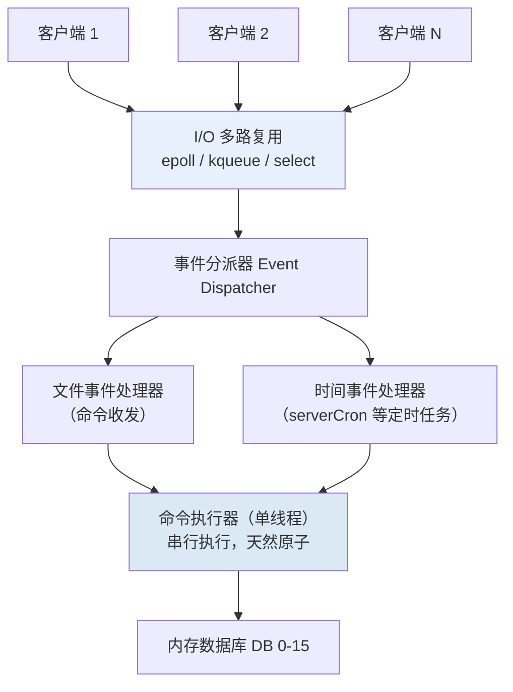
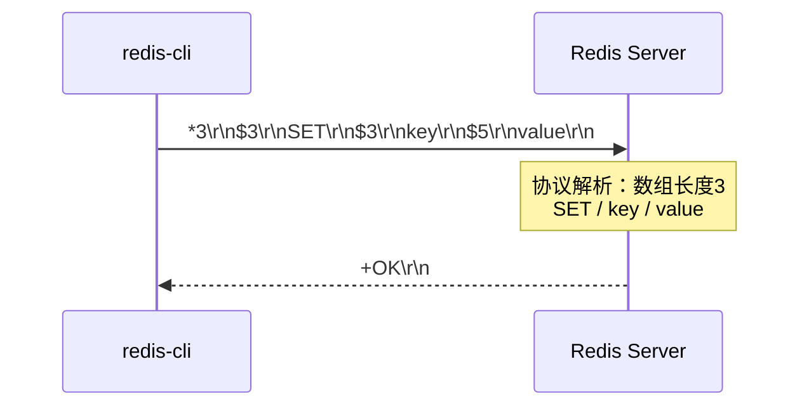

# 01 Redis 架构与核心概念

> Redis 采用"单线程命令执行 + IO 多路复用"模型，6.0 起 IO 多线程化但命令执行仍单线程，是理解后续持久化、复制、集群所有特性的基础。

## 零基础前置认知

**这篇在讲什么**：Redis 为什么"单线程还这么快"？本篇拆开 Redis 的运行时骨架——**命令怎么进来、怎么被调度、怎么执行、怎么把结果送回去**（IO 多路复用 + 事件循环 + 命令执行器），以及它和客户端说话用的 **RESP 协议**（RESP2/RESP3）。读完你能画出一条 `SET` 命令从网络到内存的完整链路、说清"单线程"三个字到底指什么、RESP3 解决了 RESP2 什么问题，并知道 Redis 7/8 在架构层的增量。

> 辅助类比：把 Redis 想成"只有一个柜员的银行柜台"——**单线程命令执行**=柜员一次只服务一个客户（命令天然串行、无锁），**IO 多路复用**=大堂叫号机（epoll 同时盯着几百个窗口，哪个窗口有人举手（可读/可写事件）就通知柜员去处理），**事件循环**=柜员一天的工作循环（处理举手→做业务→处理定时任务→继续听叫号），**RESP3**=新的叫号协议（柜台主动喊号/推消息，不用客户反复来问）。"只有一个柜员"恰恰是又快又稳的原因：不用抢笔（无锁）、不用换座位（无上下文切换）。

**基础名词集**：


| 名词                    | 一句话定义                                     | 与相邻概念的关系                                                                |
| ----------------------- | ---------------------------------------------- | ------------------------------------------------------------------------------- |
| 单线程命令执行          | 命令处理在一个主线程串行完成                   | 与"IO 多线程（仅网络读写）"互补：执行仍单线程，保证原子性                       |
| IO 多路复用             | 单线程同时监听大量连接就绪事件的机制           | epoll（Linux）/kqueue（macOS）封装在 aeEventLoop 里；是"单线程承载高并发"的前提 |
| 事件循环（aeEventLoop） | 文件事件 + 时间事件的统一调度器                | 文件事件处理命令、时间事件跑 serverCron 等定时任务                              |
| RESP 协议               | 客户端↔服务端的序列化协议                     | RESP2（数组/字符串…）→ RESP3（6.0+，新增 Push/Map/Set/客户端缓存 tracking）   |
| BIO 后台线程            | 4.0 起的异步后台线程（关 fd/刷 AOF/懒释放）    | 与主线程解耦，避免大 Key 删除/fsync 阻塞命令                                    |
| 客户端缓存 tracking     | RESP3 Push +`CLIENT TRACKING` 的服务端失效通知 | 让客户端本地缓存与 Redis 保持一致，省 RTT                                       |
| 命令管道（Pipeline）    | 批命令一次往返（11 篇详述）                    | 与"IO 多线程"都用于缓解网络吞吐瓶颈                                             |

> 区分/注意：**"Redis 单线程" ≠ "整个进程只有一个线程"**——严格说是**命令执行单线程**：自 4.0 起有 BIO 后台线程，6.0 起网络读写可交给 `io-threads` 线程池，RDB/AOF 重写还 fork 子进程；只有"执行命令"这一环始终单线程。**IO 多路复用 ≠ 异步 IO**：epoll 是同步非阻塞 + 就绪通知（内核告诉你"可读了"），不是内核帮你读完（AIO 才是）。**RESP3 不是新语言**：它是 RESP2 的超集，旧客户端用 `HELLO 3` 协商，默认仍是 RESP2（Redis 8 起客户端库普遍默认 RESP3）。

## 学习目标


| 目标                             | 级别    |
| -------------------------------- | ------- |
| 理解 Redis 单线程模型为何快      | L1 认知 |
| 掌握 IO 多路复用与事件循环机制   | L2 操作 |
| 区分 RESP2 与 RESP3 协议差异     | L2 操作 |
| 掌握 Redis 6.0 IO 多线程配置     | L3 架构 |
| 了解 Redis 7/8 核心新特性        | L1 认知 |
| 对比 Redis 与 Memcached 架构差异 | L3 架构 |

## 前置知识

- 已阅读 [00 总览与导读](../00_总览与导读/00_总览与导读.md) 了解 22 篇文档地图
- 具备基本 Linux 命令行与网络知识（TCP、epoll 概念）
- 后续将进入 [02 数据类型与底层实现](../02_数据类型与底层实现/02_数据类型与底层实现.md) 学习数据结构

## 一、Redis 整体架构

Redis 采用**单进程单线程模型**（核心命令执行线程），所有客户端命令经 IO 多路复用统一调度，串行进入命令执行器。

### 1.1 架构总览图



### 1.2 核心组件说明


| 组件           | 作用                   | 说明                                                |
| -------------- | ---------------------- | --------------------------------------------------- |
| I/O 多路复用   | 同时监听多个客户端连接 | Linux 用 epoll、Mac 用 kqueue、通用 select          |
| 文件事件处理器 | 处理客户端命令         | 命令请求 → 命令读取 → 命令执行 → 结果返回        |
| 时间事件处理器 | 处理定时任务           | serverCron（默认每 100ms 执行一次，负责过期清理等） |
| 命令执行器     | 执行 Redis 命令        | 单线程串行执行，保证原子性                          |

### 1.3 命令执行完整生命周期

一次 `SET key value` 命令的完整路径：

```
1. 客户端发送命令
   redis-cli → TCP → Redis 服务器

2. I/O 多路复用检测到可读事件
   epoll_wait() 返回，告知某个 fd 有数据可读

3. 文件事件处理器回调
   ├── readQueryFromClient()：从 fd 读取数据
   ├── 数据写入客户端查询缓冲区（querybuf）
   └── 调用协议解析器

4. 协议解析
   ├── processInputBuffer()：解析 RESP 协议
   ├── 提取命令名和参数
   └── 查找命令表（redisCommandTable），定位 SET 处理函数

5. 命令执行前检查
   ├── 检查命令参数个数
   ├── 检查客户端认证状态
   ├── 检查内存限制（maxmemory）
   ├── 检查集群状态
   └── 检查 ACL 权限

6. 调用 SET 命令处理函数
   ├── setCommand() → genericSet()
   ├── 查找或创建 key 对应的 RedisObject
   ├── 设置值（SDS 编码）
   ├── 设置过期时间（如果有 EX/PX 参数）
   └── 更新 LRU/LFU 时钟

7. 命令执行后处理
   ├── 写入 AOF 缓冲区（如果开启 AOF）
   ├── 传播到从服务器（如果开启复制）
   ├── 通知键空间事件（如果开启通知）
   └── 更新统计信息

8. 返回结果
   ├── 构造 RESP 响应（+OK\r\n）
   ├── 写入客户端输出缓冲区
   └── 注册可写事件，等待发送
```

### 1.4 进程模型与内存架构

```
Redis 进程内存布局：
┌───────────────────────────────────────────┐
│  主线程（命令执行 + I/O 多路复用）          │
├───────────────────────────────────────────┤
│  I/O 线程池（6.0+，仅网络读写）            │
├───────────────────────────────────────────┤
│  BIO 后台线程（4.0+）                      │
│  ├── bio_close_file（关闭 fd）            │
│  ├── bio_aof_fsync（AOF 刷盘）            │
│  └── bio_lazy_free（异步释放大 Key）      │
├───────────────────────────────────────────┤
│  子进程（fork，仅 RDB/AOF 重写期间）       │
├───────────────────────────────────────────┤
│  内存数据库（dict 哈希表 × 16 个 DB）      │
│  └── 每个 RedisObject: type|encoding|lru| │
│                          refcount|ptr      │
└───────────────────────────────────────────┘
```

## 二、单线程模型与事件驱动

### 2.1 为何选择单线程

Redis 核心设计目标是**低延迟**和**高吞吐**，单线程模型在该目标下具有独特优势：


| 优势         | 说明                                         |
| ------------ | -------------------------------------------- |
| 无锁竞争     | 避免多线程加锁/解锁的开销和死锁风险          |
| 无上下文切换 | 省去线程切换的 CPU 开销（每次切换约 1-5μs） |
| 原子性保证   | 所有命令串行执行，天然保证原子性             |
| 实现简单     | 代码逻辑清晰，易于维护和调试                 |

### 2.2 单线程为何仍快

1. **纯内存操作**：数据存储在内存中，读写速度约 100ns 级别
2. **I/O 多路复用**：单线程监听多个连接，非阻塞 I/O
3. **高效的数据结构**：针对不同场景设计专用数据结构（SDS、skiplist、listpack 等）
4. **避免无谓的系统调用**：单线程无需锁操作和线程切换

### 2.3 I/O 多路复用机制

I/O 多路复用是 Redis 高性能的核心，让单线程能同时处理数千个并发连接：

```
传统阻塞 I/O（每个连接一个线程）：
Thread1: read(fd1) → 阻塞等待 → 处理 → write(fd1)
Thread2: read(fd2) → 阻塞等待 → 处理 → write(fd2)
...
问题：线程开销大，上下文切换频繁

I/O 多路复用（单线程管理所有连接）：
epoll_create()         → 创建 epoll 实例
epoll_ctl(ADD, fd1)    → 注册 fd1
epoll_ctl(ADD, fd2)    → 注册 fd2
...
epoll_wait()           → 返回就绪 fd 列表 → 依次处理
优势：无需多线程，无需锁，O(1) 检测就绪事件
```

#### epoll vs select vs poll 对比


| 特性       | select                 | poll                   | epoll                  |
| ---------- | ---------------------- | ---------------------- | ---------------------- |
| 最大连接数 | 1024（FD_SETSIZE）     | 无限制                 | 无限制                 |
| 就绪检测   | O(N) 遍历所有 fd       | O(N) 遍历所有 fd       | O(1) 返回就绪 fd       |
| 内存拷贝   | 每次调用需拷贝 fd 集合 | 每次调用需拷贝 fd 集合 | mmap 共享内存          |
| 触发方式   | 水平触发               | 水平触发               | 水平/边缘触发          |
| 适用场景   | 少量连接               | 中等连接               | 大量连接（Redis 默认） |

### 2.4 注意：Redis 并非完全单线程

以下操作使用多线程：


| 版本         | 多线程操作                      | 触发方式   |
| ------------ | ------------------------------- | ---------- |
| Redis 4.0+   | 后台删除大 Key（`UNLINK`）      | BIO 线程   |
| Redis 4.0+   | AOF fsync                       | BIO 线程   |
| Redis 6.0+   | 网络 I/O 多线程（`io-threads`） | 主线程调度 |
| RDB/AOF 重写 | fork 子进程                     | 写时复制   |

## 三、Redis 6.0 IO 多线程

### 3.1 多线程架构

```
Redis 6.0 I/O 多线程架构：
┌──────────────────────────────────────────────────┐
│                   主线程                          │
│  ┌────────────────────────────────────────────┐  │
│  │  接收连接 → 读取请求 → 执行命令 → 写入响应  │  │
│  │         ↕              ↕                    │  │
│  │    I/O 线程池        I/O 线程池             │  │
│  │  (读取请求)        (写入响应)               │  │
│  └────────────────────────────────────────────┘  │
│                                                   │
│  关键：命令执行仍然是单线程，只有 I/O 是多线程    │
└──────────────────────────────────────────────────┘
```

### 3.2 配置参数

```bash
# 查看 IO 多线程配置（Redis 6.0+）
CONFIG GET io-threads
CONFIG GET io-threads-do-reads

# 开启多线程 I/O
CONFIG SET io-threads 4
CONFIG SET io-threads-do-reads yes
```


| 参数                  | 说明                     | 推荐值                          |
| --------------------- | ------------------------ | ------------------------------- |
| `io-threads`          | I/O 线程数（不含主线程） | 4 核 CPU 设 4，8 核设 6，最多 8 |
| `io-threads-do-reads` | 读操作是否多线程         | yes（写默认开启）               |

### 3.3 为什么命令执行仍单线程


| 原因                    | 说明                              |
| ----------------------- | --------------------------------- |
| 避免并发竞争和锁开销    | 数据结构无需加锁                  |
| 保证命令原子性          | 串行执行天然原子                  |
| 瓶颈在网络 I/O 而非 CPU | 随 10Gbps+ 网卡普及，网络成为瓶颈 |
| 单线程已足够快          | 10 万+ QPS 满足多数场景           |

### 3.4 适用场景

- QPS 极高（>10 万）且网络 I/O 成为瓶颈
- 大量短连接或大量 Pipeline 批量请求
- 不建议小流量场景开启，线程同步本身有开销

## 四、事件循环（aeEventLoop）

Redis 自实现事件循环库 `ae.c`，封装 epoll/kqueue/select，提供统一的事件驱动接口。

### 4.1 核心数据结构

```
aeEventLoop {
    aeFileEvent *events;     // 文件事件表（按 fd 索引）
    aeFiredEvent *fired;     // 已触发事件数组
    aeTimeEvent *timeEventHead; // 时间事件链表（按 when 排序）
    int stop;
    aeBeforeSleepProc *beforesleep; // 进入 epoll_wait 前回调
    aeBeforeSleepProc *aftersleep;  // 退出 epoll_wait 后回调
}
```

### 4.2 事件类型与注册


| 事件类型 | 注册函数                            | 触发时机     | 用途                 |
| -------- | ----------------------------------- | ------------ | -------------------- |
| 文件事件 | `aeCreateFileEvent(fd, mask, proc)` | fd 可读/可写 | 处理客户端连接与命令 |
| 时间事件 | `aeCreateTimeEvent(ms, proc)`       | 定时到达     | serverCron 定时任务  |

### 4.3 事件循环主流程

```
aeMain(eventLoop):
    while (!eventLoop->stop):
        aeProcessEvents(eventLoop, AE_ALL_EVENTS):
            1. 计算最近时间事件的剩余时间
            2. 调用 beforesleep 钩子
               ├── flushAppendOnlyFile（AOF 刷盘）
               ├── handleClientsBlockedOnKeys（唤醒阻塞客户端）
               └── beforeSleep 处理待写客户端
            3. epoll_wait 等待事件（带超时）
            4. 调用 aftersleep 钩子
            5. 处理就绪文件事件
            6. 处理到期时间事件（如 serverCron）
```

### 4.4 serverCron 定时任务

`serverCron` 默认每 100ms（`hz=10`）执行一次，负责：


| 任务                | 频率 | 说明                  |
| ------------------- | ---- | --------------------- |
| 过期 Key 清理       | 每次 | 主动删除策略          |
| 内存淘汰检查        | 每次 | 超过 maxmemory 触发   |
| 哨兵定时任务        | 每次 | 哨兵模式下监控        |
| 集群心跳            | 每次 | Gossip 协议通信       |
| 后台任务检查        | 每次 | 检查 RDB/AOF 重写完成 |
| 客户端超时关闭      | 每次 | idle 超过 timeout     |
| 哈希表渐进式 rehash | 每次 | 协助迁移              |

## 五、RESP 协议（RESP2 vs RESP3）

Redis 使用 **RESP（REdis Serialization Protocol）** 协议进行客户端与服务端通信，人类可读、解析高效。

### 5.1 RESP2 协议格式


| 类型       | 前缀 | 说明         | 示例                               |
| ---------- | ---- | ------------ | ---------------------------------- |
| 简单字符串 | `+`  | 状态响应     | `+OK\r\n`                          |
| 错误       | `-`  | 错误信息     | `-ERR unknown command\r\n`         |
| 整数       | `:`  | 整数结果     | `:1\r\n`                           |
| 批量字符串 | `$`  | 二进制安全   | `$6\r\nfoobar\r\n`                 |
| 数组       | `*`  | 命令参数列表 | `*2\r\n$3\r\nfoo\r\n$3\r\nbar\r\n` |

一次 `SET` 命令的完整通信（RESP2 帧格式）：



批量字符串为二进制安全：通过长度前缀 `$6` 读取，不依赖 `\r\n` 分隔，可包含任意字节。

### 5.2 RESP3 新增类型（Redis 6.0+）


| 类型            | 前缀 | 说明                     | 示例                                     |
| --------------- | ---- | ------------------------ | ---------------------------------------- |
| Blob error      | `!`  | 详细错误信息             | `!21\r\nSYNTAX invalid syntax\r\n`       |
| Verbatim string | `=`  | 原样字符串（带格式标注） | `=15\r\ntxt:Hello world\r\n`             |
| Big number      | `(`  | 超过 64 位整数           | `(12345678901234567890\r\n`              |
| Map             | `%`  | 键值对集合               | `%2\r\n+foo\r\n:1\r\n+bar\r\n:2\r\n`     |
| Set             | `~`  | 集合类型                 | `~2\r\n+a\r\n+b\r\n`                     |
| Attribute       | `\|`  | 元数据                   | 用于附加推送属性                         |
| Push            | `>`  | 推送消息                 | `>2\r\n$7\r\nmessage\r\n$5\r\nhello\r\n` |
| Boolean         | `#`  | 布尔值                   | `#t\r\n` 或 `#f\r\n`                     |
| Double          | `,`  | 浮点数                   | `,1.23\r\n`                              |
| Null            | `_`  | 统一空值                 | `_\r\n`                                  |

### 5.3 切换到 RESP3

```bash
# 客户端握手时协商切换
HELLO 3 [AUTH user pass] [SETNAME name]

# 查看支持的协议
HELLO
```

### 5.4 RESP3 核心能力：客户端缓存 tracking

RESP3 的 Push 类型支持服务端主动推送，配合 `CLIENT TRACKING ON` 实现客户端缓存：

```
客户端缓存机制：
┌─────────┐  1. GET key (miss)         ┌─────────┐
│ Client  │ ──────────────────────────► │ Redis   │
│ 本地缓存 │ ◄── 2. value ────────────── │ 服务端  │
│         │                             │         │
│         │  3. 另一客户端修改 key        │         │
│         │ ◄── 4. Push 失效通知 ──────── │         │
│         │  5. 失效本地缓存             │         │
└─────────┘                             └─────────┘
```

```bash
# 客户端 A 开启 tracking
CLIENT TRACKING ON
GET user:1001            # 缓存到本地

# 客户端 B 修改 key
SET user:1001 "new_value"
# 此时 A 会收到 Push 失效通知
```


| tracking 模式 | 说明                           | 适用场景     |
| ------------- | ------------------------------ | ------------ |
| OFF           | 关闭                           | 默认         |
| ON            | 默认模式，仅通知 key 失效      | 单连接客户端 |
| BCAST         | 广播模式，按前缀订阅           | 多实例客户端 |
| OPTIN         | 按需开启（CLIENT CACHING YES） | 选择性缓存   |

## 六、Redis 7/8 核心新特性


| 特性                  | 版本 | 说明                                                 | 影响                                                                                                                                                                          |
| --------------------- | ---- | ---------------------------------------------------- | ----------------------------------------------------------------------------------------------------------------------------------------------------------------------------- |
| Redis Functions       | 7.0  | 替代 Lua 脚本，支持持久化函数库                      | 详见[07 事务与 Lua 脚本](../07_事务与Lua脚本/07_事务与Lua脚本.md)                                                                                                             |
| Multi-part AOF        | 7.0  | AOF 拆分为 base + incr + manifest                    | 提升可靠性与性能                                                                                                                                                              |
| listpack 替代 ziplist | 7.0  | 紧凑列表编码全面替代 ziplist                         | 解决 cascade update 问题                                                                                                                                                      |
| Sharded Pub/Sub       | 7.0  | 分片发布订阅，按槽路由                               | Cluster 下 Pub/Sub 不再全集群广播                                                                                                                                             |
| ACL v2                | 7.0  | Selector 机制，更细粒度权限                          | 详见[12 安全与运维](../12_安全与运维/12_安全与运维.md)                                                                                                                        |
| 模块内置化            | 8.0  | RediSearch/Search/JSON/TimeSeries/Bloom 成为内置模块 | 无需 Redis Stack；向量检索直接可用（见 16 篇）                                                                                                                                |
| Vector Sets           | 8.0  | 原生向量集类型（`VADD`/`VSIM`）                      | 比"向量 + 索引"更内建，详见[02 数据类型](../02_数据类型与底层实现/02_数据类型与底层实现.md) 与 [16 向量存储与 RAG](../16_Redis向量存储与RAG应用/16_Redis向量存储与RAG应用.md) |
| 协议与许可            | 8.0  | 客户端默认 RESP3；开源许可转 AGPLv3                  | 社区版迭代节奏变化，README 与 99 附录版本表同步                                                                                                                               |

### 6.1 listpack 替代 ziplist 的原因

ziplist 存在 **cascade update（连锁更新）** 问题：当某个 entry 的长度变化时，可能引发后续所有 entry 重新分配内存。

```
ziplist cascade update 问题：
┌──────┬──────┬──────┬──────┬──────┐
│entry1│entry2│entry3│entry4│entry5│   每个 entry 记录前一个 entry 长度
└──────┴──────┴──────┴──────┴──────┘
   251B   251B   251B   251B   251B  (prevlen 字段用 1 字节)
        ▲
        修改 entry1 长度 → 超过 253B → prevlen 改用 5 字节
        → entry2 长度变化 → entry3 prevlen 也要变
        → ... 全链路更新，最坏 O(N²)

listpack 解决方案：
┌──────┬──────┬──────┬──────┐
│entry1│entry2│entry3│entry4│   每个 entry 只记录自己的长度
└──────┴──────┴──────┴──────┘
        修改任意 entry 不影响其他 entry
```

listpack 已在 Redis 7 中全面替代 ziplist，用于 Hash、List、Set、ZSet 的小数据量编码。详见 [02 数据类型与底层实现](../02_数据类型与底层实现/02_数据类型与底层实现.md)。

### 6.2 Redis Functions 实战

```bash
# 创建函数库
FUNCTION LOAD "#!lua name=mylib
redis.register_function('my_get', function(keys, args)
    return redis.call('GET', keys[1])
end)
redis.register_function('my_set', function(keys, args)
    return redis.call('SET', keys[1], args[1])
end)
"

# 调用函数
FCALL my_get 1 mykey
FCALL my_set 1 mykey "hello"

# 查看所有函数库
FUNCTION LIST

# 删除函数库
FUNCTION DELETE mylib

# 转储函数库（备份），返回二进制 payload
FUNCTION DUMP

# 恢复函数库（用 -x 从 stdin 读取上一步 DUMP 出的二进制 payload）
redis-cli -x FUNCTION RESTORE < /tmp/redis_functions_dump.bin
# 返回：OK
```


| 对比项   | Lua 脚本（EVAL）   | Functions                 |
| -------- | ------------------ | ------------------------- |
| 持久化   | 不持久化，重启丢失 | 持久化到 RDB/AOF          |
| 复制传播 | 每次传播脚本内容   | 仅传播函数调用            |
| 管理     | SCRIPT LOAD/FLUSH  | FUNCTION LOAD/LIST/DELETE |
| 适用     | 临时脚本           | 长期复用业务逻辑          |

### 6.3 Sharded Pub/Sub

Redis 7 引入 Sharded Pub/Sub，消息按频道所在哈希槽路由，不再全集群广播：

```bash
# 传统 Pub/Sub（Cluster 下全节点广播，浪费带宽）
SUBSCRIBE channel1
PUBLISH channel1 "msg"

# Sharded Pub/Sub（按槽路由，仅相关节点处理）
SSUBSCRIBE channel1          # 分片订阅
SPUBLISH channel1 "msg"      # 分片发布
```


| 对比项       | 普通 Pub/Sub      | Sharded Pub/Sub     |
| ------------ | ----------------- | ------------------- |
| Cluster 广播 | 全节点广播        | 仅槽所在节点        |
| 带宽消耗     | 高                | 低                  |
| 命令         | SUBSCRIBE/PUBLISH | SSUBSCRIBE/SPUBLISH |
| 适用         | 跨节点广播        | 大规模集群          |

## 七、Redis vs Memcached 架构对比


| 对比项   | Redis                                                       | Memcached               |
| -------- | ----------------------------------------------------------- | ----------------------- |
| 线程模型 | 单线程命令执行 + 6.0 IO 多线程                              | 多线程（Worker 线程池） |
| 数据类型 | 9 大类型（String/List/Hash/Set/ZSet/Bitmap/HLL/Geo/Stream） | 仅 String               |
| 持久化   | RDB + AOF + 混合                                            | 无                      |
| 集群     | 原生 Cluster（16384 槽）                                    | 客户端分片              |
| 内存管理 | jemalloc + 多种淘汰策略                                     | slab + LRU              |
| 最大 Key | 512MB                                                       | 1MB                     |
| 事务     | MULTI/EXEC + Lua                                            | 无                      |
| 发布订阅 | 支持（含 Sharded）                                          | 不支持                  |
| 协议     | RESP2/RESP3                                                 | 二进制协议              |
| 适用场景 | 缓存 + 数据存储 + 消息队列                                  | 纯缓存                  |

## 📖 深入阅读


| 主题                        | 文档                                                                                                           |
| --------------------------- | -------------------------------------------------------------------------------------------------------------- |
| 数据类型与编码转换          | [02 数据类型与底层实现](../02_数据类型与底层实现/02_数据类型与底层实现.md)                                     |
| 持久化机制详解              | [03 持久化机制](../03_持久化机制/03_持久化机制.md)                                                             |
| 内存管理与淘汰策略          | [04 内存管理与淘汰策略](../04_内存管理与淘汰策略/04_内存管理与淘汰策略.md)                                     |
| 事务与 Lua/Functions        | [07 事务与 Lua 脚本](../07_事务与Lua脚本/07_事务与Lua脚本.md)                                                  |
| 安全与 ACL v2               | [12 安全与运维](../12_安全与运维/12_安全与运维.md)                                                             |
| Redis vs Memcached 全面对比 | [19 Redis 与 Memcached/MySQL/PG 对比](../19_Redis与Memcached_MySQL_PG对比/19_Redis与Memcached_MySQL_PG对比.md) |

## 本章小结


| 要点         | 说明                                                                                |
| ------------ | ----------------------------------------------------------------------------------- |
| 单线程模型   | 命令执行单线程，避免锁竞争与上下文切换                                              |
| 高性能来源   | 纯内存 + IO 多路复用 + 高效数据结构                                                 |
| IO 多线程    | 6.0+ 网络 IO 多线程，命令执行仍单线程                                               |
| 事件循环     | aeEventLoop 统一调度文件事件与时间事件                                              |
| RESP3        | 支持推送、客户端缓存 tracking                                                       |
| Redis 7/8    | Functions、Multi-part AOF、listpack、Sharded Pub/Sub、模块内置与 Vector Sets（8.0） |
| vs Memcached | 类型丰富、可持久化、原生集群                                                        |

## 小思考题帮你巩固

1. **"Redis 单线程"到底指什么？为什么这种设计反而吞吐高？**（提示：命令执行单线程 ≠ 整个进程单线程；无锁 + 无上下文切换 + IO 多路复用，见零基础与二。）
2. **IO 多路复用（epoll）和"异步 IO"（AIO）是一回事吗？**（提示：epoll 只通知"可读/可写"就绪，读写仍由自己完成，见二 2.3。）
3. **RESP3 的 `Push` 类型解决了 RESP2 的什么痛点？客户端缓存 tracking 怎么配合？**（提示：RESP2 是"请求-响应"一问一答；Push 让服务端主动推送失效通知，见五 5.4。）
4. **为什么 6.0 引入 IO 多线程，命令执行却仍坚持单线程？**（提示：瓶颈在网络读写而非命令执行；若执行也并行，就得给数据结构加锁、失去原子性，见三 3.3。）
5. **`io-threads-do-reads yes` 是让读也并行吗？开启多线程 IO 为什么小流量反而更慢？**（提示：读默认关闭、写开启；线程同步本身有开销，见三 3.4。）

<details>
<summary>参考答案（点击展开）</summary>

1. 指**命令执行单线程**：处理客户端命令的主线程只有一个，命令串行执行、天然原子。快因为：纯内存 100ns 级读写；IO 多路复用把"等 IO"的时间省下来（单线程同时监听海量连接）；无锁无上下文切换（每次线程切换约 1-5μs）。但 4.0 起的 BIO 后台线程（关 fd/刷 AOF/懒释放大 Key）、6.0 起的 IO 多线程（网络读写）、RDB/AOF 重写 fork 子进程都不在"命令执行"这一环。
2. 不是。epoll 是**同步非阻塞 + 就绪通知**：内核只告诉"哪个 fd 可读/可写"，数据仍由你自己 read/write；AIO 是内核帮你完成读写后回调。epoll 的目的不是"省掉读写"，而是"单线程能同时盯着大量连接"。
3. RESP2 是一问一答，服务端无法主动推送；RESP3 的 `Push`（`>` 前缀）让服务端能推送消息。配合 `CLIENT TRACKING ON`，服务端在 key 被其他客户端修改时主动 Push 失效通知，客户端清掉本地缓存——这是 RESP2 做不到的（只能靠短 TTL 或轮询）。
4. 因为真正的瓶颈在网络 I/O（网卡吞吐）而非命令执行本身：多线程只分担"读写 socket"这个无共享、可并行的部分；命令执行仍单线程，数据结构就无需加锁、命令保持原子。若执行也并行，复杂度和锁开销会抵消收益。
5. `io-threads-do-reads yes` 表示读操作也交给 IO 线程池（默认读在主线程、写走线程池）。线程间有同步开销（锁/内存屏障），低流量时反而增加延迟——所以官方建议仅在"大量网络 IO 吞吐压满"时才开启并逐步调优。

</details>

## 最佳实践与常见陷阱

> 本节的每条都来自 Redis 开发/排障实战，按"现象 → 原因 → 处置"组织，聚焦架构层最容易误判的点。


| # | 陷阱                          | 现象                              | 原因                                                                          | 处置                                                             |
| - | ----------------------------- | --------------------------------- | ----------------------------------------------------------------------------- | ---------------------------------------------------------------- |
| 1 | 以为"单线程 = 单核"去加多实例 | 单实例 CPU 用不满却 QPS 上不去    | 命令执行单线程，但 IO 多路复用让单线程足以跑满几十万 QPS；瓶颈常在网络/客户端 | 先自查网络 IO 与客户端连接；真到 CPU 瓶颈再考虑 Cluster 分片     |
| 2 | 无脑开`io-threads`            | 小流量延迟反而升高、CPU 抖动      | IO 线程有同步开销，低流量无收益                                               | 仅在"千兆/万兆网卡 + 高并发 Pipeline"场景按 4/6/8 逐步调（见三） |
| 3 | 把大 Key 用`DEL` 直接删       | 命令卡住（阻塞其他客户端几百 ms） | 单线程执行 DEL 需同步释放大内存                                               | 用`UNLINK`（懒释放走 BIO 线程）；大 Key 扫描见 11 篇             |
| 4 | 客户端用旧版 RESP2 硬编码解析 | 无法享受 Push/客户端缓存          | 未用`HELLO 3` 协商                                                            | 客户端库升级到支持 RESP3（redis-py 5+/ioredis 5+）默认即 RESP3   |
| 5 | 把`CLIENT TRACKING` 当兜底    | 缓存与 Redis 偶发不一致           | BCAST/OPTIN 模式或网络抖动下 Push 可能丢失部分通知                            | tracking 是优化不是一致性保证；关键数据靠主动失效                |
| 6 | 混淆`EVAL` Lua 与 Functions   | 脚本重启丢失/每次传播脚本体       | Lua 不持久化、按脚本传播                                                      | 长期复用逻辑用 Functions（FUNCTION LOAD/FCALL），见 07 篇        |

> **一句话总结**：理解 Redis 架构的钥匙是"**命令执行单线程 + IO 多路复用**"这对组合——它决定了 Redis 的吞吐上限、原子性保证和所有调优方向（IO 多线程只是为喂饱网卡、BIO/子进程只是不阻塞主线程）；协议层从 RESP2 到 RESP3 的升级，则是让"客户端缓存"这类高价值优化成为可能。

## 下一步导航

- 下一篇：[02 数据类型与底层实现](../02_数据类型与底层实现/02_数据类型与底层实现.md) — 学习 9 大数据类型与编码转换
- 相关篇：[03 持久化机制](../03_持久化机制/03_持久化机制.md) — Multi-part AOF 详解
- 相关篇：[07 事务与 Lua 脚本](../07_事务与Lua脚本/07_事务与Lua脚本.md) — Functions 深入
- 相关篇：[11 性能调优与监控](../11_性能调优与监控/11_性能调优与监控.md) — IO 多线程调优
