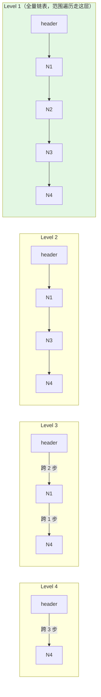

# 02 数据类型与底层实现

> Redis 提供 9 大数据类型，每种类型对应多种底层编码，依据数据量与元素大小自动转换，理解编码转换阈值与底层结构是做出正确选型的关键。

## 零基础前置认知

**这篇在讲什么**：Redis 的"类型"背后是**可变编码**——同一个 String 可能是 int/embstr/raw，同一个 Hash 可能是紧凑的 listpack 或哈希表，存的数据越"小而规整"越省内存、越快。本篇逐个拆开 9 大类型：**每个类型先记命令速查（开发天天用）→ 再看底层结构（为什么快/省）→ 最后落在应用场景（什么时候用哪个）**。读完你能说出 String 44 字节、Hash 128 元素/64 字节这些转换阈值，画出 SDS/quicklist/skiplist 的样子，并按复杂度与内存效率给业务选型。

> 辅助类比：把数据类型的底层编码想成"打包行李"——**listpack/intset** 是"小行李一个拉链袋"（数据少且规整时，连续内存一次装下，省空间却搬动笨重），**hashtable/skiplist** 是"大行李用收纳箱+标签"（数据多了拆分层级结构，找得快但有额外指针开销）；Redis 自动在两者间切换（**编码升级**）：拉链袋装满（超过阈值）就换收纳箱，但**只升不降**。**SDS** 像"带粉笔记录的便签"（开头记着长度，读长度 O(1) 且不怕二进制乱码）；**skiplist** 像"多层电梯楼梯"（高层大步跨、低层细走，范围遍历沿最低层走到底）。

**基础名词集**：

| 名词 | 一句话定义 | 与相邻概念的关系 |
|------|-----------|----------------|
| RedisObject | 每个键值对的对象头（type/encoding/lru/refcount/ptr，16B） | 与底层数据结构（SDS/dict/quicklist…）分离：同类型可换不同"编码" |
| 编码（encoding） | 同一种类型的内存布局方案（如 String 有 int/embstr/raw） | 由 `OBJECT ENCODING` 查看；随数据规模自动升级、一般不回退 |
| SDS | Redis 自研字符串：len+alloc+数据 | 代替 C 字符串：O(1) 长度、二进制安全、预分配扩容 |
| listpack | 紧凑列表编码（连续内存，entry 只记自身长度） | 替代 ziplist（7.0），消除连锁更新；用于小 Hash/List/Set/ZSet |
| quicklist | 由多个 listpack 节点组成的双向链表 | List 的"大"形态；节点间可 LZF 压缩（list-compress-depth） |
| skiplist | 多层有序链表（概率层高） | 与 dict 双结构支撑 ZSet：skiplist 管范围、dict 管单点 |
| intset | 有序整数数组（二分查找） | Set 的全整数形态；`set-max-intset-entries`（默认 512）内使用 |
| Radix Tree | 压缩前缀树 | Stream 用 radix tree + listpack 节点组织消息 ID |
| 编码升级（conversion） | 数据规模超阈值后从紧凑编码转到通用结构 | 只升不降：如 listpack→hashtable、intset→hashtable、listpack→skiplist |

> 区分/注意：**"数据类型" ≠ "编码"**——数据类型（String/List/Hash…）是 API 视角，编码（int/embstr/raw…）是内存布局视角，同一类型可多种编码；`TYPE` 看类型、`OBJECT ENCODING` 看编码。**紧凑编码只升不降**：Hash 一旦超阈值转 hashtable，删掉部分元素也不会自动回到 listpack（要回退需重写 key）。**44/128/512 这些阈值可调**：通过 `hash-max-listpack-entries` 等配置，但调完只影响新写入数据。

## 学习目标

| 目标 | 级别 |
|------|------|
| 掌握 9 大数据类型常用命令 | L2 操作 |
| 理解每种类型的底层编码与转换阈值 | L1 认知 |
| 绘制 SDS、listpack、skiplist 等核心结构 | L2 操作 |
| 区分 listpack 与 ziplist 差异 | L1 认知 |
| 完成 Redis 与 MySQL 类型映射选型 | L3 架构 |

## 前置知识

- 已阅读 [01 Redis 架构与核心概念](../01_Redis架构与核心概念/01_Redis架构与核心概念.md) 理解单线程与 RedisObject 结构
- 了解基本数据结构概念（链表、哈希表、跳表）
- 后续将进入 [03 持久化机制](../03_持久化机制/03_持久化机制.md) 学习数据如何落盘

## 一、RedisObject 与编码概述

### 1.1 RedisObject 结构

每个键值对通过 RedisObject 封装：

```
┌─────────────────────────────────────────────────────────┐
│ type(4bit) │ encoding(4bit) │ lru(24bit) │ refcount(4B) │ ptr(8B) │
└─────────────────────────────────────────────────────────┘

- type：数据类型（String/List/Hash/Set/ZSet/Stream 等）
- encoding：编码方式（同类型可有多种编码）
- lru：LRU 时钟或 LFU 计数器（24bit）
- refcount：引用计数（共享对象机制）
- ptr：指向实际数据指针

RedisObject 共 16 字节，jemalloc 按 16 字节对齐。
```

### 1.2 类型与编码总览

| 数据类型 | 可能编码（Redis 7，8 沿用此体系） | 转换方向 |
|----------|---------------------|----------|
| String | int / embstr / raw | int→embstr→raw |
| List | quicklist（listpack 节点） | 节点内 listpack 压缩可调 |
| Hash | listpack / hashtable | listpack→hashtable |
| Set | intset / listpack / hashtable | intset/listpack→hashtable |
| ZSet | listpack / skiplist+dict | listpack→skiplist |
| Stream | listpack（节点内） + Radix Tree | — |
| Bitmap | String（直接复用） | — |
| HyperLogLog | 稀疏 / 密集 | 稀疏→密集 |
| Geo | Sorted Set | — |
| Vector Set（8.0 新增） | 原生向量集（经搜索索引） | 独立类型，命令 `VADD`/`VSIM`，见 [16 向量存储与 RAG](../16_Redis向量存储与RAG应用/16_Redis向量存储与RAG应用.md) |

### 1.3 编码查看命令

```bash
# 查看某个 key 的编码
OBJECT ENCODING mykey

# 查看类型
TYPE mykey
```

## 二、String（字符串）

### 2.1 命令速查

| 命令 | 说明 | 示例 |
|------|------|------|
| `SET key value [EX s] [NX/XX]` | 设置 | `SET k v EX 60 NX` |
| `GET key` | 获取 | `GET k` |
| `INCR / DECR key` | 自增/自减 1 | `INCR counter` |
| `INCRBY / DECRBY key n` | 自增/自减 n | `INCRBY counter 10` |
| `INCRBYFLOAT key n` | 浮点数增减 | `INCRBYFLOAT price 0.5` |
| `SETEX key s value` | 带过期设置 | `SETEX k 10 v` |
| `MSET / MGET` | 批量设/取 | `MSET k1 v1 k2 v2` |
| `APPEND key value` | 追加 | `APPEND msg " world"` |
| `STRLEN key` | 长度 | `STRLEN msg` |
| `GETRANGE key start end` | 取子串 | `GETRANGE msg 0 4` |
| `GETDEL key` | 取值并删除（6.2+） | `GETDEL token:tmp` |
| `GETEX key [EX s] [PX ms] [PERSIST]` | 取值并改/清过期（6.2+） | `GETEX sess:1 EX 60` |

### 2.2 底层实现：SDS

Redis 自定义 SDS（Simple Dynamic String），未直接使用 C 字符串：

```
C 字符串：
┌─────┬─────┬─────┬─────┬─────┐
│ 'R' │ 'e' │ 'd' │ 'i' │ '\0'│
└─────┴─────┴─────┴─────┴─────┘

SDS：
┌──────────┬──────────┬─────┬─────┬─────┬─────┬─────┐
│ len = 4  │ alloc=4  │ 'R' │ 'e' │ 'd' │ 'i' │ '\0'│
└──────────┴──────────┴─────┴─────┴─────┴─────┴─────┘
```

| 特性 | C 字符串 | SDS |
|------|---------|-----|
| 获取长度 | O(N) 遍历 | O(1) 直接读 len |
| 缓冲区溢出 | 可能溢出 | 空间预分配，自动扩容 |
| 内存重分配 | 每次 N 次 | 最多 N 次（预分配 + 惰性释放） |
| 二进制安全 | 靠 `\0` 判断结束 | 靠 len 判断，可含 `\0` |
| 兼容 C 字符串 | — | 末尾保留 `\0` |

### 2.3 三种编码与转换

| 编码 | 条件 | 说明 |
|------|------|------|
| `int` | 值为整数且 ≤ long 范围 | 直接存储在 ptr 指针位置 |
| `embstr` | 字符串长度 ≤ 44 字节 | RedisObject 与 SDS 一次分配，紧凑存储 |
| `raw` | 字符串长度 > 44 字节 | RedisObject 与 SDS 两次分配 |

```
转换关系：
  SET k 123              → int 编码
  SET k "abc"            → embstr 编码（≤44B）
  SET k "<40B 字符串>"   → embstr 编码（≤44B）
  SET k "<超 44B 字符串>" → raw 编码（>44B 即转 raw，如 50B）

注意：embstr 只读，任何修改操作（APPEND/INCRBY 等）都会转为 raw。
```

### 2.4 应用场景

| 场景 | 用法 |
|------|------|
| 缓存对象 JSON | `SET user:1 '{"name":"zs"}'` |
| 计数器 | `INCR page:views:home` |
| 分布式锁 | `SET lock:1 uuid EX 10 NX` |
| 限流（固定窗口） | `INCR rate:user:1001` + EXPIRE |
| 全局 ID | `INCR global:order:id` |

## 三、List（列表）

### 3.1 命令速查

| 命令 | 说明 |
|------|------|
| `LPUSH / RPUSH key v...` | 左/右插入 |
| `LPOP / RPOP key [n]` | 左/右弹出 |
| `BLPOP / BRPOP key timeout` | 阻塞弹出 |
| `LRANGE key start stop` | 范围获取 |
| `LINDEX key i` | 索引获取 |
| `LSET key i v` | 索引设置 |
| `LINSERT key BEFORE/AFTER pivot v` | 插入 |
| `LTRIM key start stop` | 裁剪 |
| `LLEN key` | 长度 |
| `LMOVE src dst LEFT/RIGHT LEFT/RIGHT` | 原子转移一个元素（6.2+，替代 RPOPLPUSH） |
| `RPOPLPUSH src dst` | 转移（旧命令，已被 LMOVE 取代） |

### 3.2 底层实现：quicklist

Redis 7 中 List 统一使用 quicklist（由 listpack 节点组成的双向链表）：

```
quicklist 结构：
┌─────────────────────────────────────────────────────┐
│  prev ◄── ┌──────────┐ ◄── next ──► ┌──────────┐  │
│           │ listpack │               │ listpack │  │
│           │(节点1)   │               │(节点2)   │  │
│           └──────────┘               └──────────┘  │
└─────────────────────────────────────────────────────┘

单个 listpack 节点：
┌───────┬───────┬───────┬───────┬───────┐
│ elem1 │ elem2 │ elem3 │ elem4 │  end  │
└───────┴───────┴───────┴───────┴───────┘
```

### 3.3 编码与压缩策略

| 配置 | 默认值 | 说明 |
|------|--------|------|
| `list-max-listpack-size` | -2 | 每个 listpack 节点大小（-2 表示 ≤8KB） |
| `list-compress-depth` | 0 | 两端保留不压缩的节点数（1 表示首尾各 1 节点不压缩） |

> **注意**：Redis 7 中 List 不再有单独的 listpack 编码，统一为 quicklist。节点是否启用 LZF 压缩由 `list-compress-depth` 控制。

### 3.4 应用场景

| 场景 | 用法 |
|------|------|
| 消息队列（简单） | LPUSH + BRPOP |
| 最新列表 | LPUSH + LRANGE 0 9 |
| 安全队列 | RPOPLPUSH 实现确认机制 |
| 朋友圈时间线 | LPUSH feed:uid post_id |

## 四、Hash（哈希）

### 4.1 命令速查

| 命令 | 说明 |
|------|------|
| `HSET key f v [f v...]` | 设置字段 |
| `HGET key f` | 获取字段 |
| `HMGET key f...` | 批量获取 |
| `HGETALL key` | 获取所有 |
| `HDEL key f...` | 删除字段 |
| `HEXISTS key f` | 字段是否存在 |
| `HINCRBY key f n` | 字段自增 |
| `HSETNX key f v` | 字段不存在时设置 |
| `HKEYS / HVALS key` | 所有字段/值 |
| `HSCAN key cursor [MATCH p] [COUNT n]` | 增量遍历 |

### 4.2 底层实现与编码转换

```
编码选择逻辑：
元素数量 ≤ 128 且每个值 ≤ 64 字节？
    ├── 是 → listpack（紧凑存储，连续内存）
    └── 否 → hashtable（哈希表 + 渐进式 rehash）

listpack 结构（连续内存）：
┌────────┬────────┬────────┬────────┬────────┐
│ field1 │ val1   │ field2 │ val2   │  end   │
└────────┴────────┴────────┴────────┴────────┘

hashtable 结构：
┌─────────────────────────────────────┐
│  ┌─────┬─────┬─────┬─────┬─────┐   │
│  │桶0  │桶1  │桶2  │桶3  │ ... │   │
│  └──┬──┴─────┴──┬──┴─────┴─────┘   │
│     ▼           ▼                   │
│  ┌──────┐    ┌──────┐              │
│  │dictEntry│  │dictEntry│            │
│  │key→val │  │key→val │            │
│  └──────┘    └──────┘              │
└─────────────────────────────────────┘
```

### 4.3 渐进式 rehash

哈希表扩容/缩容时采用渐进式 rehash，分摊到每次操作中避免阻塞：

```
rehash 过程：
┌──────────────┐     ┌──────────────┐
│   旧哈希表    │ ──► │   新哈希表    │
│  (ht[0])     │     │  (ht[1])     │
│  逐步迁移 ◄──┤     ├──► 逐步接收  │
└──────────────┘     └──────────────┘

每次操作时迁移 ht[0] 中一个桶的数据到 ht[1]
rehash 期间，读操作先查 ht[0] 再查 ht[1]，写操作写入 ht[1]
```

### 4.4 编码转换触发条件

| 配置参数 | 默认值 | 说明 |
|----------|--------|------|
| `hash-max-listpack-entries` | 128 | 元素数量超过即转 hashtable |
| `hash-max-listpack-value` | 64 | 单元素超过 64B 即转 hashtable |

### 4.5 应用场景

| 场景 | 用法 |
|------|------|
| 对象存储 | `HSET user:1 name "zs" age 25` |
| 配置中心 | `HSET config:app key value` |
| 购物车 | `HSET cart:uid product_id count` |
| 部分更新对象 | 仅修改字段，无需重写整个 JSON |

## 五、Set（集合）

### 5.1 命令速查

| 命令 | 说明 |
|------|------|
| `SADD key m...` | 添加 |
| `SREM key m...` | 删除 |
| `SMEMBERS key` | 所有元素 |
| `SISMEMBER key m` | 是否存在 |
| `SCARD key` | 数量 |
| `SRANDMEMBER key [n]` | 随机取 |
| `SPOP key [n]` | 随机弹 |
| `SINTER / SUNION / SDIFF` | 交/并/差 |
| `SINTERSTORE dst k...` | 交集存入 |
| `SSCAN key cursor [MATCH p] [COUNT n]` | 增量遍历 |

### 5.2 底层编码

| 编码 | 条件 | 说明 |
|------|------|------|
| `intset` | 全整数且数量 ≤ `set-max-intset-entries`（默认 512） | 有序整数数组，二分查找 O(logN) |
| `listpack` | 元素少且短（Redis 7 新增） | 紧凑存储 |
| `hashtable` | 不满足以上条件 | O(1) 查找 |

```
intset 结构（有序整数数组）：
┌───────┬───────┬───────┬───────┐
│  1    │  3    │  5    │  7    │
└───────┴───────┴───────┴───────┘
（升序排列，二分查找 O(logN)）
升级：插入更大整数时，整个数组升级编码（int16→int32→int64）
```

### 5.3 转换触发条件

| 配置参数 | 默认值 | 说明 |
|----------|--------|------|
| `set-max-intset-entries` | 512 | 超过即转 hashtable |
| `set-max-listpack-entries` | 128 | 超过即转 hashtable |
| `set-max-listpack-value` | 64 | 单元素超过即转 hashtable |

### 5.4 应用场景

| 场景 | 用法 |
|------|------|
| 标签 | `SADD tag:java user:1 user:2` |
| 共同好友 | `SINTER user:1:friends user:2:friends` |
| 去重 | `SADD unique:user:ip "1.2.3.4"` |
| 抽奖 | `SPOP lottery 1` |
| 黑白名单 | `SADD blacklist:ip "1.2.3.4"` |

## 六、Sorted Set（有序集合）

### 6.1 命令速查

| 命令 | 说明 |
|------|------|
| `ZADD key s m [s m...] [GT/LT] [CH]` | 添加（带分数；GT/LT 条件改分，CH 返回变更数，6.2+） |
| `ZRANGE key s e [WITHSCORES]` | 升序范围 |
| `ZREVRANGE key s e` | 降序范围 |
| `ZRANGEBYSCORE key min max` | 按分数范围 |
| `ZPOPMIN / ZPOPMAX key [n]` | 弹出最小/最大元素（5.0+） |
| `ZSCORE key m` | 取分数 |
| `ZINCRBY key n m` | 增加分数 |
| `ZRANK / ZREVRANK key m` | 排名 |
| `ZCARD key` | 数量 |
| `ZCOUNT key min max` | 分数范围内数量 |
| `ZREM key m` | 删除 |
| `ZREMRANGEBYRANK / ZREMRANGEBYSCORE` | 按排名/分数删除 |
| `ZINTERSTORE / ZUNIONSTORE` | 交集/并集 |

### 6.2 底层编码

```text
编码选择逻辑：
元素数量 ≤ 128 且每个元素 ≤ 64 字节？
    ├── 是 → listpack（按分数升序排列）
    └── 否 → skiplist + hashtable（双结构）
```

skiplist 结构（多层索引链表，高层跨步大、低层全量）：



> 同时维护一个 hashtable，O(1) 获取元素分数；skiplist 负责范围查询 O(logN)，hashtable 负责单点查询 O(1)。

### 6.3 为什么用跳表不用红黑树

| 对比项 | 跳表 | 红黑树 |
|--------|------|--------|
| 实现复杂度 | 简单，易于调试 | 复杂，旋转操作多 |
| 范围查询 | 天然支持（链表遍历即可 O(logN+M)） | 需中序遍历，平摊 O(N) |
| 内存占用 | 额外指针（每层 2 个） | 额外指针（3 个 + 颜色位） |
| 删除节点 | 直接修改前驱后继指针完成 | 需红黑树旋转与颜色调整 |
| 插入/删除 | O(logN)，按概率层高平衡 | O(logN)，旋转平衡 |

> 注：不要用"跳表更容易实现无锁并发"来解释 Redis 选型——**Redis 命令执行是单线程**，根本不存在并发修改压力，无锁并发不是选型因素。真实原因是：① 范围查询天然高效（沿 level-1 链表遍历）；② 实现/调试比红黑树简单得多（无旋转与重着色规则）；③ 层高按概率分布即可保证 O(logN)，配合 Redis 自身的随机化场景足够。

### 6.4 转换触发条件

| 配置参数 | 默认值 | 说明 |
|----------|--------|------|
| `zset-max-listpack-entries` | 128 | 超过即转 skiplist |
| `zset-max-listpack-value` | 64 | 单元素超过即转 skiplist |

### 6.5 应用场景

| 场景 | 用法 |
|------|------|
| 排行榜 | `ZADD game:rank 9500 "玩家A"` |
| 延迟队列 | `ZADD delay:queue <timestamp> <task>` |
| 热搜 | `ZINCRBY hot:search 1 "关键词"` |
| 时间线 | `ZADD feed:uid <ts> post_id` |
| 范围查询 | `ZRANGEBYSCORE scores 80 90` |

## 七、Bitmap（位图）

### 7.1 命令速查

| 命令 | 说明 |
|------|------|
| `SETBIT key offset value` | 设置位 |
| `GETBIT key offset` | 获取位 |
| `BITCOUNT key [start end]` | 统计为 1 的位数 |
| `BITOP AND/OR/XOR/NOT dst k...` | 位运算 |
| `BITPOS key bit [start end]` | 查找首个 0/1 |
| `BITFIELD key [GET/SET/INCRBY ...]` | 位域操作（任意位宽整数的读写自增，3.2+） |

### 7.2 底层实现

直接复用 String 类型，将字符串视为位数组：

```
SETBIT user:login:20230101 7 1
内存布局：
┌─byte0─┬─byte1─┬─byte2─┐
│00000001│00000000│00000000│   ← offset 7 设置为 1
└────────┴────────┴────────┘
```

### 7.3 应用场景

| 场景 | 用法 |
|------|------|
| 用户签到 | `SETBIT sign:uid:202301 0 1`（按月） |
| 在线状态 | `SETBIT online 1234 1` |
| 布隆过滤器 | 用 Bitmap 模拟（建议用 RedisBloom 模块） |
| 统计活跃用户 | `BITCOUNT active:20230101` |
| 连续签到 | `BITOP AND result day1 day2` |

## 八、HyperLogLog（基数统计）

### 8.1 命令速查

| 命令 | 说明 |
|------|------|
| `PFADD key e...` | 添加元素 |
| `PFCOUNT key` | 估算基数 |
| `PFMERGE dst k...` | 合并多个 HLL |

### 8.2 底层原理

基于概率统计算法，通过哈希值前导零个数估算基数。固定消耗 12KB 内存，标准误差 0.81%。

```
稀疏编码 → 密集编码：
- 元素少时用稀疏编码（节省内存）
- 元素增多后转为密集编码（固定 12KB）
```

### 8.3 HyperLogLog vs Set

| 对比项 | Set | HyperLogLog |
|--------|-----|-------------|
| 内存占用 | 随元素数增长 | 固定 12KB |
| 精确度 | 100% 精确 | 0.81% 标准误差 |
| 适用场景 | 需要精确计数 | 允许误差的大规模 UV 统计 |

### 8.4 应用场景

| 场景 | 用法 |
|------|------|
| 页面 UV | `PFADD page:uv:home "user1"` |
| 日活 | `PFADD dau:20230101 "user_id"` |
| 月活合并 | `PFMERGE mau:202301 dau:20230101 dau:20230102 ...` |
| 搜索关键词去重 | `PFADD search:uv "kw"` |

## 九、Geo（地理位置）

### 9.1 命令速查

| 命令 | 说明 |
|------|------|
| `GEOADD key lng lat m...` | 添加 |
| `GEODIST key m1 m2 [unit]` | 距离 |
| `GEOSEARCH key ... ` | 范围搜索（6.2+，替代 GEORADIUS） |
| `GEOPOS key m...` | 获取坐标 |
| `GEOHASH key m...` | GeoHash 值 |

### 9.2 底层实现

基于 Sorted Set，使用 GeoHash 编码将经纬度转换为分数：

```
经纬度 → interleave（按位交错）→ Base32 编码 → 整数 → ZSet score
116.4074, 39.9042 (北京) → GeoHash: wx4g0 → score: 4069882608292734
```

### 9.3 应用场景

```bash
# 添加商家位置
GEOADD nearby:restaurants 116.4074 39.9042 "餐厅A"
GEOADD nearby:restaurants 116.4080 39.9050 "餐厅B"

# 查找附近 3km 内餐厅（按距离升序，最多 10 个）
GEOSEARCH nearby:restaurants FROMLONLAT 116.4074 39.9042 BYRADIUS 3 km WITHDIST WITHCOORD ASC COUNT 10

# 矩形范围搜索
GEOSEARCH nearby:restaurants FROMLONLAT 116.4074 39.9042 BYBOX 5 5 km WITHDIST
```

| 场景 | 用法 |
|------|------|
| 附近的人 | `GEOSEARCH` BYRADIUS |
| 外卖配送 | 距离计算 `GEODIST` |
| 地理围栏 | 范围内成员检测 |
| 打车匹配 | 司机位置 + 乘客位置搜索 |

## 十、Stream（流）

### 10.1 命令速查

| 命令 | 说明 |
|------|------|
| `XADD key [MAXLEN n] * f v...` | 添加消息 |
| `XLEN key` | 消息数量 |
| `XRANGE key - + [COUNT n]` | 范围读取 |
| `XREVRANGE key + -` | 反向读取 |
| `XREAD [BLOCK ms] STREAMS k id` | 读取 |
| `XGROUP CREATE key g id` | 创建消费组 |
| `XREADGROUP GROUP g c ...` | 消费组读取 |
| `XACK key g id...` | 确认消息 |
| `XPENDING key g` | 待处理消息 |
| `XAUTOCLAIM key g c ms id` | 认领超时消息 |
| `XTRIM key MAXLEN n` | 裁剪 |
| `XINFO STREAM key` | 流信息 |

### 10.2 底层实现：Radix Tree + listpack

```
Radix Tree（压缩前缀树）：
        root
         │
    ┌────┴────┐
    │         │
  152694   152695
  (listpack节点) (listpack节点)
    │         │
  next ───► next ───► ...

每个 listpack 节点存储多条 entry：
┌────────┬────────┬────────┐
│ entry1 │ entry2 │  end   │
└────────┴────────┴────────┘

消息 ID 格式：<毫秒时间戳>-<序列号>，全局递增
```

### 10.3 消费组模型

```
Stream 结构：
┌─────────────────────────────────────────────────────────┐
│  Entry1          Entry2          Entry3                  │
│  ┌──────────┐   ┌──────────┐   ┌──────────┐           │
│  │ID: 1630-0│   │ID: 1630-1│   │ID: 1631-0│           │
│  │field:val │   │field:val │   │field:val │           │
│  └──────────┘   └──────────┘   └──────────┘           │
│       ▲                                                │
│       │  Consumer Group A                              │
│       │  ┌──────────────────────────────────────┐     │
│       │  │ Consumer1: last_id=1630-1             │     │
│       │  │ Consumer2: last_id=1630-0             │     │
│       │  │ Pending: [未 ACK 的消息列表]           │     │
│       │  └──────────────────────────────────────┘     │
└─────────────────────────────────────────────────────────┘
```

### 10.4 实战

```bash
# 添加消息
XADD orders * user_id 1001 amount 99.9
XADD orders * user_id 1002 amount 199.9

# 创建消费组
XGROUP CREATE orders order_group $ MKSTREAM

# 消费者组读取
XREADGROUP GROUP order_group consumer1 COUNT 10 BLOCK 5000 STREAMS orders >

# 确认消息
XACK orders order_group 1630000000000-0

# 查看待处理消息
XPENDING orders order_group

# 认领超时消息（60 秒未确认的消息转移给 consumer2）
XCLAIM orders order_group consumer2 60000 1630000000000-0

# 自动认领（6.2+）
XAUTOCLAIM orders order_group consumer1 60000 0-0 COUNT 10

# 修剪
XTRIM orders MAXLEN 1000
XTRIM orders MINID 1630000000000-0
```

### 10.5 Stream vs List vs Pub/Sub

| 特性 | Stream | List | Pub/Sub |
|------|--------|------|---------|
| 消息持久化 | ✅ | ✅ | ❌ |
| 消费组 | ✅ | ❌ | ❌ |
| 消息确认 | ✅ | ❌ | ❌ |
| 消息回溯 | ✅ | ❌ | ❌ |
| 阻塞读取 | ✅ | ✅ | ✅ |
| 适用场景 | 可靠消息队列 | 简单任务队列 | 实时通知广播 |

## 十一、listpack vs ziplist 深度对比

Redis 7 中 listpack 全面替代 ziplist，原因如下：

### 11.1 ziplist 的 cascade update 问题

```
ziplist 结构：
┌──────┬──────┬──────┬──────┬──────┐
│entry1│entry2│entry3│entry4│entry5│   每个 entry 记录前一个 entry 长度
└──────┴──────┴──────┴──────┴──────┘

当 prevlen < 254 时，prevlen 字段用 1 字节
当 prevlen ≥ 254 时，prevlen 字段用 5 字节

问题场景：
若连续多个 entry 长度都在 253 字节附近：
[253B][253B][253B][253B]...
修改 entry1 → 长度变为 254B → prevlen 字段从 1 字节扩到 5 字节
→ entry2 长度变化 → 也超过 253B → entry3 prevlen 也要扩
→ entry4、entry5... 全链路更新，最坏 O(N²)
```

### 11.2 listpack 的解决方案

```
listpack 结构：
┌──────┬──────┬──────┬──────┐
│entry1│entry2│entry3│entry4│   每个 entry 只记录自己的长度
└──────┴──────┴──────┴──────┘

修改任意 entry 不影响其他 entry，避免连锁更新
```

### 11.3 对比表

| 对比项 | ziplist | listpack |
|--------|---------|----------|
| prevlen 记录 | 记录前一个 entry 长度 | 不记录 |
| 连锁更新 | 有，最坏 O(N²) | 无 |
| 内存利用率 | 高 | 高 |
| 适用 | Redis < 7.0 | Redis ≥ 7.0 |
| 编码名称 | ziplist | listpack |

## 十二、Redis vs MySQL 类型映射

| Redis 类型 | MySQL 类型 | 选型建议 |
|-----------|-----------|----------|
| String | VARCHAR / TEXT / INT / DECIMAL | 通用缓存、计数器 |
| List | — （MySQL 无对应） | 用 JSON 数组或单独表替代 |
| Hash | 一行记录（多列） | 对象存储，避免反复反序列化 JSON |
| Set | 多对多关系表 | 标签、关系运算 |
| ZSet | — （MySQL 需 ORDER BY） | 排行榜、延迟队列 |
| Bitmap | BIT / TINYINT 数组 | 签到、布尔状态 |
| HyperLogLog | COUNT(DISTINCT) | 大规模去重统计 |
| Geo | POINT + SPATIAL INDEX | 地理位置服务 |
| Stream | 消息表 + offset | 消息队列 |

## 十三、数据类型选型对比总表

| 数据类型 | 底层编码 | 时间复杂度 | 典型场景 | 内存效率 |
|----------|----------|------------|----------|----------|
| String | int/embstr/raw | O(1) | 缓存、计数器、分布式锁 | 中 |
| List | quicklist(listpack) | 头尾 O(1)，中间 O(N) | 消息队列、最新列表 | 高 |
| Hash | listpack/hashtable | O(1) | 对象存储、配置 | 高 |
| Set | intset/listpack/hashtable | O(1) | 标签、去重、共同好友 | 中 |
| Sorted Set | listpack/skiplist+dict | O(logN) | 排行榜、延迟队列 | 中 |
| Bitmap | String | O(1) | 签到、在线状态 | 极高 |
| HyperLogLog | 稀疏/密集 | O(1) | UV 统计 | 极高(12KB) |
| Geo | Sorted Set | O(logN) | 位置服务 | 中 |
| Stream | listpack + Radix Tree | O(logN) | 消息队列 | 高 |

## 📖 深入阅读

| 主题 | 文档 |
|------|------|
| RedisObject 与单线程模型 | [01 Redis 架构与核心概念](../01_Redis架构与核心概念/01_Redis架构与核心概念.md) |
| 内存淘汰与编码相关的内存影响 | [04 内存管理与淘汰策略](../04_内存管理与淘汰策略/04_内存管理与淘汰策略.md) |
| 事务与 Lua 操作多类型 | [07 事务与 Lua 脚本](../07_事务与Lua脚本/07_事务与Lua脚本.md) |
| Stream 消息队列深度实战 | [08 发布订阅与消息队列](../08_发布订阅与消息队列/08_发布订阅与消息队列.md) |
| 缓存模式与类型选型 | [09 缓存模式与实战](../09_缓存模式与实战/09_缓存模式与实战.md) |
| 大 Key 检测与拆分 | [11 性能调优与监控](../11_性能调优与监控/11_性能调优与监控.md) |

## 本章小结

| 要点 | 说明 |
|------|------|
| 9 大数据类型 | String/List/Hash/Set/ZSet/Bitmap/HLL/Geo/Stream |
| 编码自动转换 | 依据元素数量与大小，listpack→高级结构 |
| listpack 替代 ziplist | Redis 7 解决 cascade update 问题 |
| skiplist + dict 双结构 | ZSet 兼顾范围查询与单点查询 |
| Stream 消费组 | 支持持久化、ACK、回溯，对标 Kafka |
| Bitmap/HLL 内存友好 | 12KB HLL 即可统计亿级 UV |
| 类型选型 | 按 O 复杂度、内存效率、业务场景综合选型 |

## 小思考题帮你巩固

1. **`TYPE` 与 `OBJECT ENCODING` 分别回答什么问题？为什么 String 明明是一种类型却有三种编码？**（提示：类型是 API 视角、编码是内存视角；int/embstr/raw 是"值形态"对应的内存布局，见一 1.1/1.2。）
2. **`SET k "值"` 后 `APPEND` 一下编码就变了，为什么？**（提示：embstr 只读、一次分配，修改需整体重排内存转 raw；int 被 INCR 超出范围也会转，见 2.3。）
3. **为什么 Redis 7 用 listpack 全面替换 ziplist？"连锁更新"到底是什么场景下才发生的坏节？**（提示：ziplist 每个 entry 记 prevlen，前一项超 253B 会连锁扩 5 字节直到 O(N²)；listpack 只记自身长度，见 11。）
4. **Hash 超过阈值转 hashtable 后，删到只剩几个字段会自动转回 listpack 吗？为什么？**（提示：编码只升不降，回退需重写 key，见零基础"区分/注意"。）
5. **ZSet 为什么要 skiplist + dict 双结构？只用跳表或只用哈希不行吗？**（提示：跳表擅长按分数范围遍历、哈希擅长按成员 O(1) 取分；单用任一个都缺一半能力，见 6.2。）
6. **排行榜、点赞去重、页面 UV、消息队列这四类业务分别选什么类型？**（提示：ZSet 排行、Set 去重、HLL 近似 UV、Stream 可靠队列，见 6.5/5.4/8.4/10.5。）

<details>
<summary>参考答案（点击展开）</summary>

1. `TYPE` 回答"这是什么类型"（String/List/Hash…），`OBJECT ENCODING` 回答"值当前用什么编码存"（int/embstr/raw…）。String 的值可能是整数（int 存指针位置）、短字符串（embstr 一次分配）、长字符串（raw 两次分配）——同一类型按"值形态"选内存布局，让小数据极省内存。
2. embstr 是 RedisObject 与 SDS 一次分配、只读紧凑块；`APPEND` 这类修改需要可动态扩容的 SDS，只能释放重建为 raw（两次分配）。同理 `INCR` 使整数超 long 范围也会转 raw。
3. ziplist 的 entry 用 prevlen 记录"前一项长度"，prevlen≥254 时占 5 字节。当一串元素长度都卡在 253B 附近时，改动首项使其超 254B，会导致后一项 prevlen 变长、继而再触发下一项，最坏 O(N²) 连锁。listpack 让每个 entry 只记录"自身长度"，改动互不影响，彻底消除连锁更新（见 11）。
4. 不会。编码转换是**单向升级**（listpack→hashtable），删除元素不会自动回退；因为回退需要把整个哈希重写成紧凑布局，Redis 不为此做反向迁移。想回退需手动重写该 key（或换 key 名）。这也是"误放大 value"会造成该 key 永久占用 hashtable"的原因。
5. skiplist 支持按 score 高效范围遍历（ZRANGEBYSCORE/排名区间），dict 支持按 member O(1) 查 score——排行榜场景两者恰好互补；单用跳表取单点分数要 O(logN) 遍历、单用哈希做不到按分数排序。双结构以"空间换时间"（一份数据两份引用）。
6. 排行榜→ZSet（分数排序+ZINCRBY）；点赞去重/共同好友→Set（SINTER/SISMEMBER O(1)）；页面 UV→HyperLogLog（亿级去重且固定 12KB、允许 0.81% 误差）；可靠消息队列→Stream（持久化+消费组+ACK+回溯）。

</details>

## 最佳实践与常见陷阱

> 本节的每条都来自 Redis 数据类型实战，按"现象 → 原因 → 处置"组织。

| # | 陷阱 | 现象 | 原因 | 处置 |
|---|------|------|------|------|
| 1 | 小 Hash 误存了个大字段 | 该 key 编码永久变 hashtable | 单个 value 超 `hash-max-listpack-value`（64B）触发升级且不回退 | 对象字段保持短小；大字段（如全文）单独 String 存 |
| 2 | 用 String 存 JSON 频繁改单字段 | 每次整串重写、并发冲突多 | JSON 整体读写没有字段级原子性 | 用 Hash 存对象字段（HSET/HINCRBY 字段级原子） |
| 3 | 排行榜用 ZREVRANGE 旧 API | 新代码提示弃用/行为不清 | `ZREVRANGE` 被弃用，推荐 `ZRANGE key 0 -1 REV` | 用 `ZRANGE ... REV`（6.2+ 语法）读取降序 |
| 4 | 列表安全队列还用 RPOPLPUSH | 功能对但已被 LMOVE 取代 | RPOPLPUSH 无方向参数 | 用 `LMOVE src dst RIGHT LEFT`（6.2+） |
| 5 | 去重计数上亿用了 Set | 内存几十 GB 扛不住 | Set 精确但随元素线性增长 | 允许近似则换 HyperLogLog（12KB 固定）；需精确分桶再考虑 |
| 6 | 把消息直接挂 List 当队列 | 消费者崩溃消息丢失、多消费者抢消息 | 无 ACK/回溯/分组 | 可靠消息用 Stream（消费组+ACK+XAUTOCLAIM，见 10 与 08 篇） |
| 7 | 未确认编码就做内存预估 | 估算与实测差几倍 | 忽略了紧凑编码（intset/listpack）带来的大幅节省 | 用 `MEMORY USAGE key` / `DEBUG OBJECT`（或 OBJECT ENCODING）实测后估算 |

> **一句话总结**：Redis 数据类型的杠杆在"**理解编码是自动的、升级是单向的**"——小数据走紧凑编码（listpack/intset/embstr）省内存、大数据进结构型编码（hashtable/skiplist）保速度，选型时按"值的形态与规模"挑最贴合的类型，并按复杂度与内存效率双轴决策（见 13 选型总表）。

## 下一步导航

- 下一篇：[03 持久化机制](../03_持久化机制/03_持久化机制.md) — 数据如何落盘
- 相关篇：[04 内存管理与淘汰策略](../04_内存管理与淘汰策略/04_内存管理与淘汰策略.md) — 编码对内存的影响
- 相关篇：[07 事务与 Lua 脚本](../07_事务与Lua脚本/07_事务与Lua脚本.md) — 跨类型原子操作
- 相关篇：[08 发布订阅与消息队列](../08_发布订阅与消息队列/08_发布订阅与消息队列.md) — Stream 深度实战
